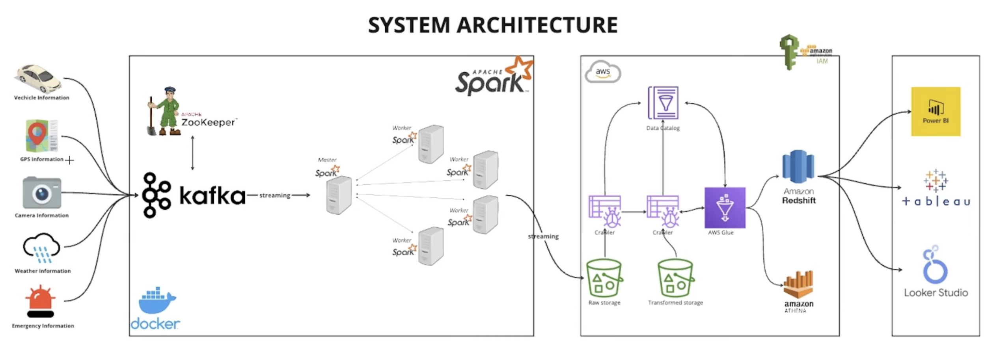

# Data Engineering Projects

## 1. Online Retail Data - Batch Data

**Dataset**: https://www.kaggle.com/datasets/tunguz/online-retail

| Column | Description |
| --- | --- |
| InvoiceNo | Invoice number. Nominal, a 6-digit integral number uniquely assigned to each transaction. If this code starts with letter 'c', it indicates a cancellation. |
| StockCode | Product (item) code. Nominal, a 5-digit integral number uniquely assigned to each distinct product. |
| Description | Product (item) name. Nominal. |
| Quantity | The quantities of each product (item) per transaction. Numeric. |
| InvoiceDate | Invice Date and time. Numeric, the day and time when each transaction was generated. |
| UnitPrice | Unit price. Numeric, Product price per unit in sterling. |
| CustomerID | Customer number. Nominal, a 5-digit integral number uniquely assigned to each customer. |
| Country | Country name. Nominal, the name of the country where each customer resides. |	

**Pipeline**

**Data Model**

### Tools used
1. Python
2. SQL
3. dbt
4. Airflow (Astro CLI)
5. Google Bigquery
6. Google cloud storage bucket
7. Soda
8. Metabase
9. Docker

## 2. Momentum(Escooter) Project - Streaming Data

**Dataset**: Augmented using random variables to imitate escooter and related data
	

**System Architecture**

### Tools used
1. Apache Kafka
2. Apache Spark
3. Zookeeper
4. Docker(Docker Compose)
5. Kafka Connect
6. Schema Registry
7. AWS S3 + Redshift
8. Python
9. SQL